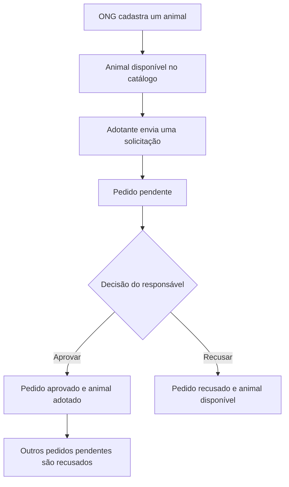

# 🐾 AdotaPet

**Uma API para conectar animais a novos lares.**

O AdotaPet organiza o processo de adoção: ONGs cadastram animais, pessoas interessadas enviam solicitações e os responsáveis acompanham e decidem cada pedido. O projeto foi desenvolvido para a disciplina de **Arquitetura de Software e Computação em Nuvem**, aplicando organização modular, validação de dados e controle de acesso.

[Funcionalidades](#funcionalidades) · [Arquitetura](#arquitetura) · [Documentação](#documentação) · [Como rodar](#como-rodar)

---

## Sobre o projeto

A aplicação oferece uma API REST com respostas em JSON e documentação interativa pelo Swagger. O fluxo principal acompanha o animal desde seu cadastro até a aprovação de uma adoção.

A versão atual funciona localmente e salva os dados em arquivo JSON. Usuários, animais e solicitações continuam disponíveis depois de reiniciar a API.

## Funcionalidades

- **Cadastro e login:** criação de contas e autenticação por token de acesso.
- **Catálogo de animais:** cadastro, consulta por identificador e busca com filtros.
- **Solicitações de adoção:** envio de pedidos e acompanhamento das próprias solicitações.
- **Gestão dos pedidos:** aprovação ou recusa pelo responsável pelo animal.
- **Persistência local:** recuperação dos dados após reiniciar a aplicação.
- **Documentação interativa:** exemplos de entrada e resposta para testar as rotas no Swagger.

### Perfis de acesso

| Perfil | O que pode fazer |
| --- | --- |
| Visitante | Consultar animais, criar uma conta e acessar a documentação. |
| Adotante | Solicitar adoção e consultar seus próprios pedidos. |
| ONG | Cadastrar animais e decidir os pedidos dos animais sob sua responsabilidade. |
| Administrador | Cadastrar animais e decidir os pedidos dos animais que cadastrou. |

O cadastro público aceita os perfis **ONG** e **ADOTANTE**. A decisão de adoção exige vínculo com o animal, inclusive para o administrador.

### Fluxo de adoção



Um adotante não pode ter dois pedidos pendentes para o mesmo animal. Animais adotados não recebem novos pedidos, e solicitações já analisadas não podem ser decididas novamente.

## Tecnologias

| Tecnologia | Papel no projeto |
| --- | --- |
| TypeScript | Linguagem do código-fonte e definição dos tipos. |
| Node.js | Ambiente de execução da API. |
| NestJS 11 e Express | Estrutura dos módulos, injeção de dependências e rotas HTTP. |
| class-validator e class-transformer | Validação e transformação dos dados recebidos. |
| OpenAPI / Swagger | Documentação e experimentação das rotas. |
| Jest e NestJS Testing | Testes automáticos de integração. |
| Prettier | Padronização da formatação do código. |
| Mermaid | Diagramas editáveis da arquitetura e dos fluxos. |

## Arquitetura

O projeto utiliza um **monólito modular com separação de responsabilidades**. Os módulos compartilham o mesmo processo e são organizados por funcionalidade.

| Responsabilidade | Implementação |
| --- | --- |
| Receber requisições HTTP | Controllers. |
| Validar entradas | DTOs e validação global. |
| Autenticar requisições | AuthGuard e AuthService. |
| Aplicar regras e permissões | Services de cada módulo. |
| Definir os modelos | Interfaces e tipos de domínio. |
| Carregar e salvar os dados | StoreService e validação do arquivo persistido. |

### Organização das pastas

```text
src/
├── common/                     # Recursos compartilhados
│   ├── decorators/             # Tratamento de campos de entrada
│   ├── security/               # Hash e verificação de senhas
│   └── swagger/                # Exemplos e contratos de resposta
├── domain/                     # User, Animal e Application
├── infrastructure/
│   └── persistence/            # Leitura, validação e gravação em JSON
├── modules/
│   ├── auth/                   # Cadastro, login e autenticação
│   ├── animals/                # Catálogo e cadastro de animais
│   ├── applications/           # Solicitações e decisões de adoção
│   └── health/                 # Verificação de disponibilidade da API
├── app.module.ts               # Integração dos módulos
├── setup-app.ts                # Configuração HTTP e Swagger
└── main.ts                     # Inicialização do servidor

test/                           # Testes HTTP e de persistência
docs/arquitetura/                # Relatório e diagramas
```

Os módulos separam controllers, services e DTOs conforme a necessidade. O código editável fica em `src/`; `dist/` contém o JavaScript gerado pela compilação e `node_modules/` guarda as bibliotecas instaladas. As duas últimas pastas são geradas localmente e ficam fora do GitHub.

## Autenticação e armazenamento

As senhas são armazenadas como **hash scrypt com salt individual**. O login retorna um token opaco, válido por 24 horas, enviado no cabeçalho `Authorization: Bearer <token>`. A implementação atual não utiliza JWT.

Os dados de negócio são salvos em `data/adotapet.json`. As sessões ficam somente em memória: após reiniciar, os cadastros permanecem, mas é necessário fazer novo login.

- As alterações são gravadas antes da resposta de sucesso.
- Uma falha de gravação retorna `503` e restaura o estado anterior em memória.
- Um arquivo existente inválido impede a inicialização e não é sobrescrito.
- O armazenamento atual deve ser utilizado por **um único processo da API por arquivo**.

A pasta `data/`, os arquivos `.env` e as preferências locais do editor não são versionados. Preserve os dados ao atualizar a aplicação e mantenha backups privados.

## Documentação

📄 **[Consultar o relatório acadêmico em PDF](docs/arquitetura/AdotaPet.pdf)**

Os diagramas estão disponíveis em arquivos `.mmd`, editáveis no Mermaid:

| Visão | Diagrama |
| --- | --- |
| Contexto do sistema | [Contexto C4](docs/arquitetura/diagramas/01-contexto-c4.mmd) |
| Aplicação e armazenamento | [Containers C4](docs/arquitetura/diagramas/02-containers-c4.mmd) |
| Componentes internos | [Componentes C4](docs/arquitetura/diagramas/03-componentes-c4.mmd) |
| Modelagem do domínio | [Classes UML](docs/arquitetura/diagramas/04-classes-uml.mmd) |
| Aprovação de adoção | [Diagrama de sequência](docs/arquitetura/diagramas/06-sequencia-aprovacao.mmd) |
| Estrutura atual | [Visão geral](docs/arquitetura/diagramas/08-arquitetura-atual.mmd) e [responsabilidades](docs/arquitetura/diagramas/09-camadas.mmd) |

**Evoluções previstas:** JWT, PostgreSQL, Redis, idempotência, tratamento de erros em Problem Details, logs estruturados, controle de vazão, Docker Compose e implantação em VPS. Esses recursos ainda não fazem parte da execução atual. O [modelo relacional](docs/arquitetura/diagramas/05-modelo-relacional.mmd) e o [diagrama de implantação](docs/arquitetura/diagramas/07-implantacao-vps.mmd) representam propostas futuras.

## Qualidade e testes

Os testes verificam as rotas HTTP, validação, autenticação, permissões, regras de adoção e contratos do Swagger. Também verificam a recuperação dos dados após reiniciar e o comportamento diante de falhas de armazenamento, usando arquivos temporários e dados isolados.

| Comando | Finalidade |
| --- | --- |
| `npm test -- --runInBand` | Executar os testes automáticos. |
| `npm run typecheck` | Verificar tipos, imports e variáveis sem uso. |
| `npm run format:check` | Conferir a formatação. |
| `npm run format` | Aplicar o padrão de formatação. |
| `npm run build` | Compilar a aplicação para a pasta `dist/`. |

---

## Como rodar

### 1. Pré-requisitos

Tenha **Git**, **Node.js 20 ou superior** e **npm** instalados. A versão atual não exige Docker nem um servidor de banco de dados.

### 2. Baixar e instalar

```bash
git clone https://github.com/KerollayneAkemy/API--ADOTAPET.git
cd API--ADOTAPET
npm ci
```

Se o projeto já estiver no computador, abra o terminal na pasta que contém o arquivo `package.json` e execute `npm ci`.

### 3. Iniciar a API

```bash
npm run start:dev
```

Mantenha esse terminal aberto enquanto utiliza a aplicação.

| Acesso | Endereço |
| --- | --- |
| Swagger interativo | http://localhost:3000/docs |
| Contrato OpenAPI em JSON | http://localhost:3000/docs-json |
| Saúde da API | http://localhost:3000/api/health |

O prefixo `/api` faz parte das rotas; acessar somente `http://localhost:3000/api` retorna `404` porque não existe uma rota definida nesse endereço.

### 4. Testar uma adoção pelo Swagger

Na primeira execução, quando o arquivo de dados ainda não existe, a API cria a cadela Mel e estas **contas fictícias de demonstração local**:

| Perfil | E-mail | Senha |
| --- | --- | --- |
| ONG | ong@adotapet.local | 123456 |
| Adotante | adotante@adotapet.local | 123456 |
| Administrador | admin@adotapet.local | 123456 |

1. Abra o Swagger e execute `POST /api/auth/login` com a conta de adotante.
2. Copie o `accessToken` da resposta. Clique em **Authorize**, cole somente o token e confirme.
3. Consulte `GET /api/animals` e copie o ID de um animal disponível, sem aspas.
4. Execute `POST /api/animals/{animalId}/applications` usando esse ID e o corpo abaixo:

   ```json
   {
     "reason": "Quero oferecer um lar seguro e carinhoso."
   }
   ```

5. Faça login com a ONG responsável e substitua o token em **Authorize**.
6. Consulte `GET /api/applications/me` e copie o ID da solicitação.
7. Execute `PATCH /api/applications/{id}/approve` para aprovar ou `PATCH /api/applications/{id}/reject` para recusar.

### 5. Configurações opcionais

Para alterar a porta no PowerShell:

```powershell
$env:PORT = '3001'
npm run start:dev
```

Para escolher outro arquivo de armazenamento:

```powershell
$env:DATA_FILE = 'C:\caminho\adotapet.json'
npm run start:dev
```

A aplicação lê as variáveis do ambiente do processo; arquivos `.env` não são carregados automaticamente. Execute a API a partir da raiz do projeto para utilizar sempre o mesmo caminho padrão de dados.

Para executar a versão compilada:

```bash
npm run build
npm run start:prod
```
