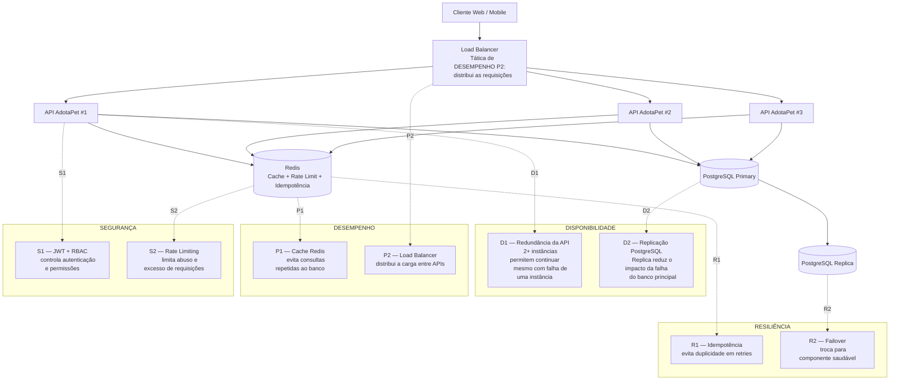

# AdotaPet — Otimização da Arquitetura da API

## Objetivo

A proposta abaixo reorganiza a arquitetura do AdotaPet para atender às quatro categorias exigidas na atividade: **Disponibilidade, Desempenho, Segurança e Resiliência**.

Cada categoria possui **duas táticas arquiteturais**, totalizando 8 táticas. O desenho contém comentários para explicar onde cada tática aparece e qual problema ela resolve.

## Problemas identificados na arquitetura atual

1. **Ponto único de falha na API:** uma única instância pode deixar o sistema indisponível se parar.
2. **Banco sem redundância:** uma falha no banco principal pode interromper as operações.
3. **Consultas repetidas ao banco:** buscas de animais podem gerar carga desnecessária no PostgreSQL.
4. **Ausência de distribuição de tráfego:** sem balanceamento, uma instância única concentra todas as requisições.
5. **Proteção insuficiente contra abuso:** rotas públicas podem receber muitas requisições.
6. **Risco de duplicidade em operações críticas:** uma repetição de requisição pode criar solicitações duplicadas.
7. **Autorização precisa ser controlada:** usuários diferentes possuem permissões diferentes.
8. **Falhas entre componentes precisam ser tratadas:** indisponibilidade temporária de dependências não deve provocar perda de operação.

# 1. Táticas de Disponibilidade

### D1 — Redundância da API

**Como funciona:** executar pelo menos duas instâncias da API atrás do Load Balancer.

**Problema resolvido:** a parada de uma instância não derruba toda a aplicação.

**Benefício:** mantém o serviço disponível durante falhas ou manutenção de uma instância.

**Comportamento em falha:** o Load Balancer deixa de enviar tráfego para a instância indisponível e encaminha para as demais.

### D2 — Replicação do PostgreSQL

**Como funciona:** manter PostgreSQL Primary e PostgreSQL Replica.

**Problema resolvido:** reduz o impacto de uma falha do banco principal.

**Benefício:** existe uma cópia do banco que pode assumir em caso de falha, conforme a estratégia de failover adotada.

**Comportamento em falha:** detectar a indisponibilidade do Primary e promover a Replica para operação.

# 2. Táticas de Desempenho

### P1 — Cache com Redis

**Como funciona:** dados consultados frequentemente, como listagens/filtros de animais, podem ser armazenados temporariamente no Redis.

**Problema resolvido:** reduz consultas repetitivas ao PostgreSQL.

**Benefício:** menor latência e menor carga no banco.

**Comportamento em falha:** se o Redis estiver indisponível, a API pode consultar o PostgreSQL diretamente, preservando a funcionalidade.

### P2 — Load Balancer

**Como funciona:** distribuir as requisições entre as instâncias da API.

**Problema resolvido:** evita concentrar toda a carga em uma única instância.

**Benefício:** aumenta a capacidade de atendimento e permite distribuir picos de acesso.

**Comportamento em falha:** instâncias que não responderem ao health check são retiradas temporariamente da distribuição.

# 3. Táticas de Segurança

### S1 — JWT + RBAC

**Como funciona:** o usuário autentica e recebe um JWT. O sistema verifica o papel do usuário (ADMIN, ONG ou ADOTANTE) antes de permitir operações protegidas.

**Problema resolvido:** impede que usuários sem permissão executem operações administrativas ou de outras funções.

**Benefício:** controle de acesso centralizado e baseado em papéis.

**Comportamento em tentativa não autorizada:** retornar HTTP 401 quando não autenticado e HTTP 403 quando autenticado, mas sem permissão.

### S2 — Rate Limiting

**Como funciona:** limitar a quantidade de requisições por período, especialmente nas rotas públicas e de autenticação.

**Problema resolvido:** reduz abuso, brute force e excesso de requisições.

**Benefício:** protege os recursos da API e melhora a estabilidade do serviço.

**Comportamento ao exceder limite:** retornar HTTP 429 (Too Many Requests).

# 4. Táticas de Resiliência

### R1 — Idempotência

**Como funciona:** operações críticas, como criação de solicitação de adoção, usam `Idempotency-Key`, armazenada no Redis.

**Problema resolvido:** evita duplicação quando o cliente repete uma mesma requisição.

**Benefício:** torna a operação segura contra retries e falhas de comunicação.

**Comportamento em repetição:** a mesma chave retorna o resultado já processado, sem criar uma nova solicitação.

### R2 — Failover

**Como funciona:** utilizar health checks e troca para componentes redundantes quando um componente principal falhar.

**Problema resolvido:** reduz o tempo de indisponibilidade causado por falhas.

**Benefício:** o sistema consegue continuar operando ou se recuperar de uma falha de componente.

**Comportamento em falha:** retirar o componente com problema da rota de atendimento e utilizar a alternativa disponível.

# Desenho arquitetural comentado

## Mapa das táticas no desenho

| Categoria | Tática 1 | Tática 2 |
|---|---|---|
| Disponibilidade | D1 — Redundância da API | D2 — Replicação PostgreSQL |
| Desempenho | P1 — Cache Redis | P2 — Load Balancer |
| Segurança | S1 — JWT + RBAC | S2 — Rate Limiting |
| Resiliência | R1 — Idempotência | R2 — Failover |

## Conclusão

A arquitetura proposta elimina pontos únicos de falha, reduz carga no banco, distribui requisições, controla acesso, limita abuso e evita duplicidade em operações críticas. Assim, a solução fica mais adequada aos requisitos de uma API escalável e preparada para execução em infraestrutura de nuvem/VPS.
