# AdotaPet — Otimização da Arquitetura da API

## 1. Objetivo

A atividade tem como objetivo analisar a arquitetura atual da API AdotaPet, identificar problemas arquiteturais e propor uma arquitetura otimizada.

A proposta deve contemplar quatro atributos de qualidade:

- **Disponibilidade**
- **Desempenho**
- **Segurança**
- **Resiliência**

Para cada atributo são aplicadas **duas táticas arquiteturais**, totalizando oito táticas.

---

# 2. Arquitetura atual

A versão inicial do AdotaPet utiliza uma API REST desenvolvida com **Node.js, TypeScript e NestJS**, seguindo os princípios de **Clean Architecture**.

A aplicação possui:

- API REST;
- autenticação com JWT;
- RBAC para controle de permissões;
- PostgreSQL como banco de dados principal;
- Redis para recursos auxiliares;
- Swagger/OpenAPI;
- Docker para execução da infraestrutura;
- operações relacionadas a usuários, ONGs, animais e solicitações de adoção.

Fluxo simplificado:

```text
Cliente
   |
   v
API AdotaPet
   |
   +----> Redis
   |
   +----> PostgreSQL
```

Apesar de atender ao funcionamento do sistema, essa arquitetura pode apresentar problemas quando houver aumento de usuários, tráfego ou falhas de infraestrutura.

---

# 3. Problemas identificados

## Problema 1 — Ponto único de falha na API

Se existir apenas uma instância da API e ela ficar indisponível, os clientes não conseguem utilizar o sistema.

### Impacto

- indisponibilidade da aplicação;
- interrupção das solicitações de adoção;
- impossibilidade de consultar animais;
- necessidade de intervenção para recuperar o serviço.

---

## Problema 2 — Ponto único de falha no banco

Uma única instância do PostgreSQL concentra os dados e as operações de persistência.

### Impacto

Se o banco principal ficar indisponível, operações importantes da aplicação também podem parar.

---

## Problema 3 — Sobrecarga por consultas repetidas

Consultas frequentes, como busca e listagem de animais, podem gerar muitas requisições ao PostgreSQL.

### Impacto

- aumento do consumo de recursos;
- aumento da latência;
- maior carga no banco;
- piora da experiência dos usuários em momentos de pico.

---

## Problema 4 — Concentração de tráfego

Sem um mecanismo de distribuição, as requisições ficam concentradas em uma única instância da API.

### Impacto

Um aumento repentino de acessos pode sobrecarregar o servidor.

---

## Problema 5 — Abuso de endpoints públicos

Rotas de autenticação e consulta pública podem receber grande quantidade de requisições.

### Impacto

- consumo excessivo de recursos;
- tentativas de brute force;
- degradação da API;
- possibilidade de indisponibilidade.

---

## Problema 6 — Duplicidade em operações críticas

Uma falha de comunicação pode fazer o cliente repetir uma requisição de criação.

Por exemplo, o usuário solicita uma adoção, mas não recebe a resposta. O cliente tenta novamente.

Sem idempotência, duas solicitações podem ser criadas.

---

# 4. Nova arquitetura proposta

A arquitetura otimizada utiliza múltiplas instâncias da API, Load Balancer, Redis e PostgreSQL com réplica.

Fluxo:

```text
Cliente
   |
   v
Segurança
   |
   v
Load Balancer
   |
   +----------+----------+
   |          |          |
   v          v          v
 API #1     API #2     API #3
   |          |          |
   +----------+----------+
              |
             Redis
              |
              v
      PostgreSQL Primary
              |
              v
      PostgreSQL Replica
```

A arquitetura foi projetada para reduzir pontos únicos de falha, melhorar o desempenho e aumentar a proteção da API.

---

# 5. Disponibilidade

## D1 — Redundância da API

### Tática

Executar duas ou mais instâncias da API simultaneamente.

As instâncias ficam atrás de um Load Balancer.

### Problema resolvido

A queda de uma instância não precisa interromper todo o sistema.

### Benefício

O sistema continua atendendo requisições enquanto existir pelo menos uma instância saudável.

### Comportamento em caso de falha

O Health Check identifica a instância indisponível e o Load Balancer deixa de encaminhar novas requisições para ela.

### Onde aparece no desenho

```text
             Load Balancer
             /     |     \
            /      |      \
        API #1   API #2   API #3
```

---

## D2 — Replicação do PostgreSQL

### Tática

Utilizar um PostgreSQL Primary e uma PostgreSQL Replica.

### Problema resolvido

Reduz o impacto de uma falha do banco principal.

### Benefício

Existe uma cópia dos dados disponível para recuperação ou promoção em caso de falha.

### Comportamento em caso de falha

Caso o Primary fique indisponível, a Replica pode ser promovida conforme o mecanismo de failover utilizado pela infraestrutura.

### Onde aparece no desenho

```text
PostgreSQL Primary
        |
        | replicação
        v
PostgreSQL Replica
```

---

# 6. Desempenho

## P1 — Cache com Redis

### Tática

Utilizar Redis para armazenar temporariamente dados consultados com frequência.

Um exemplo é o resultado de buscas e listagens de animais.

### Problema resolvido

Evita consultar o PostgreSQL repetidamente para dados que não precisam ser recalculados a cada requisição.

### Benefício

- menor latência;
- menor quantidade de consultas ao banco;
- maior capacidade de atendimento;
- melhor desempenho em períodos de pico.

### Comportamento em caso de falha

Se o Redis estiver indisponível, a aplicação pode consultar diretamente o PostgreSQL para preservar a funcionalidade.

---

## P2 — Load Balancer

### Tática

Distribuir as requisições entre múltiplas instâncias da API.

### Problema resolvido

Evita concentrar todas as requisições em um único servidor.

### Benefício

A carga é distribuída entre as instâncias disponíveis.

### Comportamento em caso de falha

O Load Balancer utiliza Health Checks para retirar temporariamente uma instância que não esteja respondendo corretamente.

---

# 7. Segurança

## S1 — JWT + RBAC

### Tática

Utilizar JWT para autenticação e RBAC para autorização baseada em papéis.

### Papéis do AdotaPet

- **ADMIN** — operações administrativas;
- **ONG** — gerenciamento de animais e solicitações;
- **ADOTANTE** — busca de animais e solicitação de adoção.

### Problema resolvido

Evita que usuários executem operações que não pertencem ao seu nível de permissão.

### Benefício

Centraliza o controle de acesso da API.

### Comportamento

- **HTTP 401** — usuário não autenticado;
- **HTTP 403** — usuário autenticado, mas sem permissão.

---

## S2 — Rate Limiting

### Tática

Limitar a quantidade de requisições que um usuário/IP pode realizar em determinado intervalo.

A proteção deve ser especialmente aplicada às rotas públicas e de autenticação.

### Problema resolvido

Reduz abuso, brute force e excesso de requisições.

### Benefício

Protege os recursos da API e contribui para a estabilidade do sistema.

### Comportamento

Quando o limite for excedido, a API deve responder:

```text
HTTP 429 — Too Many Requests
```

---

# 8. Resiliência

## R1 — Idempotência

### Tática

Utilizar `Idempotency-Key` nas operações críticas de criação.

Exemplo:

```text
POST /animals/{animalId}/applications
Idempotency-Key: 7f8a-1234-abcd
```

A chave é armazenada no Redis.

### Problema resolvido

Evita que uma mesma operação seja executada várias vezes quando o cliente realiza retries.

### Benefício

Evita solicitações de adoção duplicadas.

### Comportamento

Se a mesma chave for enviada novamente, a API reutiliza o resultado da operação anterior em vez de criar uma nova solicitação.

---

## R2 — Failover

### Tática

Utilizar componentes redundantes e Health Checks para permitir a troca para um componente saudável.

### Problema resolvido

Reduz o tempo de recuperação após uma falha.

### Benefício

A arquitetura consegue se recuperar de falhas sem depender exclusivamente de um único componente.

### Exemplo

```text
PostgreSQL Primary
       X
       |
       v
PostgreSQL Replica
       |
       v
   Failover
```

Em caso de falha do Primary, a Replica pode assumir conforme a estratégia de infraestrutura.

---

# 9. Resumo das táticas

| Atributo | Tática 1 | Tática 2 |
|---|---|---|
| **Disponibilidade** | D1 — Redundância da API | D2 — Replicação PostgreSQL |
| **Desempenho** | P1 — Cache Redis | P2 — Load Balancer |
| **Segurança** | S1 — JWT + RBAC | S2 — Rate Limiting |
| **Resiliência** | R1 — Idempotência | R2 — Failover |

Total: **8 táticas arquiteturais**.

---

# 10. Diagrama arquitetural completo

O diagrama abaixo reúne a arquitetura e identifica diretamente as oito táticas exigidas.

```mermaid
flowchart TB

    %% =====================================================
    %% CLIENTE
    %% =====================================================

    CLIENTE["👤 CLIENTE<br/>Web / Mobile"]

    %% =====================================================
    %% CAMADA DE SEGURANÇA
    %% =====================================================

    SEC["🔐 SEGURANÇA<br/><br/>
    S1 — JWT + RBAC<br/>
    Autenticação e autorização<br/>
    ADMIN / ONG / ADOTANTE<br/><br/>
    S2 — RATE LIMITING<br/>
    Limita requisições públicas<br/>
    e protege contra abuso"]

    %% =====================================================
    %% LOAD BALANCER
    %% =====================================================

    LB["⚖️ LOAD BALANCER<br/><br/>
    P2 — DESEMPENHO<br/>
    Distribui as requisições<br/>
    entre as APIs<br/><br/>
    D1 — DISPONIBILIDADE<br/>
    Permite utilizar outra API<br/>
    quando uma instância falhar"]

    %% =====================================================
    %% INSTÂNCIAS DA API
    %% =====================================================

    API1["🟦 API ADOTAPET #1<br/><br/>
    NestJS + TypeScript<br/>
    Clean Architecture"]

    API2["🟦 API ADOTAPET #2<br/><br/>
    NestJS + TypeScript<br/>
    Clean Architecture"]

    API3["🟦 API ADOTAPET #3<br/><br/>
    NestJS + TypeScript<br/>
    Clean Architecture"]

    %% =====================================================
    %% REDIS
    %% =====================================================

    REDIS["⚡ REDIS<br/><br/>
    P1 — DESEMPENHO<br/>
    Cache de dados frequentes<br/><br/>
    S2 — SEGURANÇA<br/>
    Rate Limiting<br/><br/>
    R1 — RESILIÊNCIA<br/>
    Idempotency-Key"]

    %% =====================================================
    %% POSTGRESQL
    %% =====================================================

    PG["🗄️ POSTGRESQL PRIMARY<br/><br/>
    Banco principal<br/>
    Usuários<br/>
    ONGs<br/>
    Animais<br/>
    Solicitações<br/>
    Adoções"]

    PGR["🗄️ POSTGRESQL REPLICA<br/><br/>
    D2 — DISPONIBILIDADE<br/>
    Réplica dos dados<br/><br/>
    R2 — RESILIÊNCIA<br/>
    Pode assumir em caso<br/>
    de falha do Primary"]

    %% =====================================================
    %% HEALTH CHECK
    %% =====================================================

    HEALTH["❤️ HEALTH CHECK<br/><br/>
    Verifica a saúde das<br/>
    instâncias da API e<br/>
    componentes críticos"]

    %% =====================================================
    %% FLUXO PRINCIPAL
    %% =====================================================

    CLIENTE --> SEC
    SEC --> LB

    LB --> API1
    LB --> API2
    LB --> API3

    API1 --> REDIS
    API2 --> REDIS
    API3 --> REDIS

    API1 --> PG
    API2 --> PG
    API3 --> PG

    PG -->|"Replicação"| PGR

    HEALTH -.-> API1
    HEALTH -.-> API2
    HEALTH -.-> API3
    HEALTH -.-> PG

    %% =====================================================
    %% TÁTICAS DE DISPONIBILIDADE
    %% =====================================================

    D1["🟢 D1 — DISPONIBILIDADE<br/><br/>
    REDUNDÂNCIA DA API<br/><br/>
    Múltiplas instâncias permitem<br/>
    continuar o atendimento<br/>
    quando uma API falhar."]

    D2["🟢 D2 — DISPONIBILIDADE<br/><br/>
    REPLICAÇÃO POSTGRESQL<br/><br/>
    A Replica mantém uma cópia<br/>
    dos dados e pode ser promovida<br/>
    em caso de falha do Primary."]

    %% =====================================================
    %% TÁTICAS DE DESEMPENHO
    %% =====================================================

    P1["🔵 P1 — DESEMPENHO<br/><br/>
    CACHE REDIS<br/><br/>
    Evita consultas repetidas<br/>
    ao PostgreSQL e reduz<br/>
    o tempo de resposta."]

    P2["🔵 P2 — DESEMPENHO<br/><br/>
    LOAD BALANCER<br/><br/>
    Distribui o tráfego entre<br/>
    as instâncias da API,<br/>
    evitando sobrecarga."]

    %% =====================================================
    %% TÁTICAS DE SEGURANÇA
    %% =====================================================

    S1["🔴 S1 — SEGURANÇA<br/><br/>
    JWT + RBAC<br/><br/>
    JWT autentica o usuário.<br/>
    RBAC define o que cada papel<br/>
    pode executar."]

    S2["🔴 S2 — SEGURANÇA<br/><br/>
    RATE LIMITING<br/><br/>
    Limita requisições e reduz<br/>
    abuso e brute force."]

    %% =====================================================
    %% TÁTICAS DE RESILIÊNCIA
    %% =====================================================

    R1["🟠 R1 — RESILIÊNCIA<br/><br/>
    IDEMPOTÊNCIA<br/><br/>
    Idempotency-Key evita que<br/>
    retries criem solicitações<br/>
    de adoção duplicadas."]

    R2["🟠 R2 — RESILIÊNCIA<br/><br/>
    FAILOVER<br/><br/>
    Em caso de falha de um<br/>
    componente principal,<br/>
    utiliza-se o componente<br/>
    redundante saudável."]

    %% =====================================================
    %% LIGAÇÕES EXPLICATIVAS
    %% =====================================================

    API1 -. "D1" .-> D1
    API2 -. "D1" .-> D1
    API3 -. "D1" .-> D1

    PG -. "D2" .-> D2
    PGR -. "D2" .-> D2

    REDIS -. "P1" .-> P1
    LB -. "P2" .-> P2

    SEC -. "S1" .-> S1
    REDIS -. "S2" .-> S2

    REDIS -. "R1" .-> R1
    PGR -. "R2" .-> R2

    %% =====================================================
    %% ESTILOS
    %% =====================================================

    classDef client fill:#f5f5f5,stroke:#333,stroke-width:2px;
    classDef security fill:#ffe5e5,stroke:#c62828,stroke-width:2px;
    classDef api fill:#e3f2fd,stroke:#1565c0,stroke-width:2px;
    classDef redis fill:#fff3e0,stroke:#ef6c00,stroke-width:2px;
    classDef database fill:#e8f5e9,stroke:#2e7d32,stroke-width:2px;
    classDef health fill:#fce4ec,stroke:#ad1457,stroke-width:2px;
    classDef availability fill:#e8f5e9,stroke:#388e3c,stroke-width:2px;
    classDef performance fill:#e3f2fd,stroke:#1976d2,stroke-width:2px;
    classDef resilience fill:#fff3e0,stroke:#f57c00,stroke-width:2px;

    class CLIENTE client;
    class SEC security;
    class LB,API1,API2,API3 api;
    class REDIS redis;
    class PG,PGR database;
    class HEALTH health;

    class D1,D2 availability;
    class P1,P2 performance;
    class S1,S2 security;
    class R1,R2 resilience;
```



---

# 11. Como interpretar o desenho

O fluxo começa no cliente e passa pela camada de segurança. Depois, o **Load Balancer** distribui as requisições entre as três instâncias da API.

As APIs utilizam o **Redis** para cache, rate limiting e controle de idempotência.

Para persistência, as APIs utilizam o **PostgreSQL Primary**, que possui uma **Replica**.

O **Health Check** monitora os componentes para permitir que a infraestrutura identifique instâncias indisponíveis.

As oito táticas ficam explicitamente identificadas no diagrama:

- **D1:** Redundância da API;
- **D2:** Replicação PostgreSQL;
- **P1:** Cache Redis;
- **P2:** Load Balancer;
- **S1:** JWT + RBAC;
- **S2:** Rate Limiting;
- **R1:** Idempotência;
- **R2:** Failover.

---

# 12. Conclusão

A arquitetura proposta melhora a solução original ao eliminar pontos únicos de falha, distribuir a carga, reduzir acessos desnecessários ao banco, controlar o acesso aos recursos e evitar duplicidade em operações críticas.

A combinação das oito táticas permite que o AdotaPet tenha uma arquitetura mais adequada para crescimento, operação em infraestrutura de nuvem/VPS e tratamento de falhas.

A proposta atende aos quatro atributos analisados com duas táticas para cada um:

**Disponibilidade:** Redundância da API + Replicação PostgreSQL.

**Desempenho:** Cache Redis + Load Balancer.

**Segurança:** JWT + RBAC + Rate Limiting.

**Resiliência:** Idempotência + Failover.
